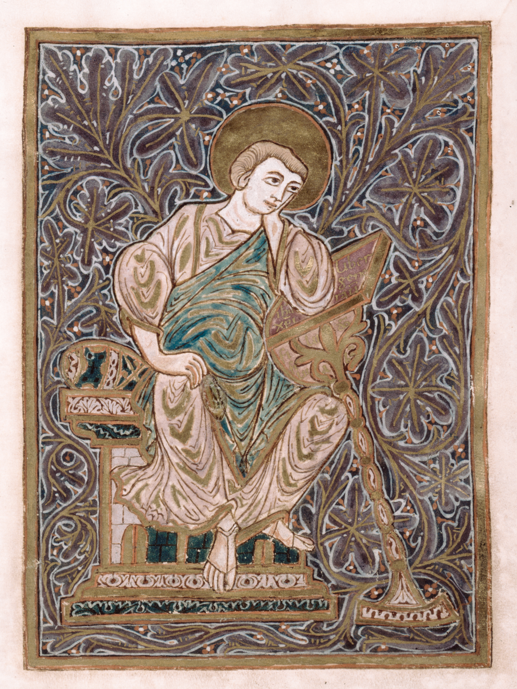
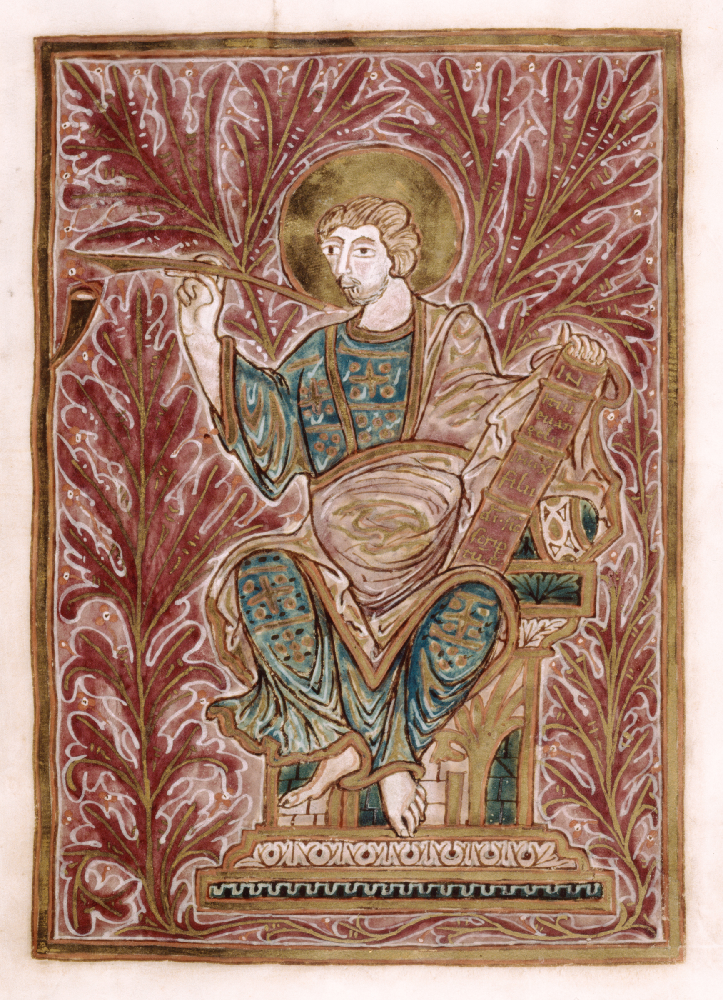

# GospelVec

<p align="center">
  
  
  
  
</p>

**Activation steering vectors derived from the four canonical Gospels.**

GospelVec provides four direction vectors extracted from the residual stream of Qwen 3.5 9B that capture the distinctive theological perspective of each Gospel (Matthew, Mark, Luke, John). When added to the model's activations during generation, these vectors steer outputs toward the theological emphasis of a specific Gospel — without any fine-tuning or weight modification.

## Key Finding: The Synoptic-Johannine Divide

The cosine similarities between Gospel vectors independently recover one of the foundational observations of biblical scholarship:

|          | Matthew | Mark   | Luke   | John     |
|----------|---------|--------|--------|----------|
| Matthew  | —       | +0.30  | +0.37  | **-0.77** |
| Mark     |         | —      | +0.39  | **-0.68** |
| Luke     |         |        | —      | **-0.81** |
| John     |         |        |        | —        |

The three Synoptic Gospels cluster together with positive similarities, while John is strongly anti-correlated with all three. The model discovered this structure purely from its pretraining data.

## Quick Start

### Interactive Steering Chat

```bash
pip install torch transformers

# Download vectors (included in repo)
# Then launch the steering chat:
python src/steer_chat.py
```

Once loaded, use commands to steer:

```
/john 3.0          # Steer toward Johannine theology
/matthew 2.0       # Add Matthean emphasis
/luke -1.5         # Suppress Lukan themes
/reset             # Zero all steering
/status            # Show current config
```

### Extracting Your Own Vectors

To re-extract vectors (or extract for a different model):

```bash
# 1. Prepare Gospel texts (KJV)
python src/prepare_data.py

# 2. Extract activations at all layers
python src/extract.py

# 3. Compute direction vectors with PCA denoising
python src/compute_vectors.py
```

## How It Works

1. **Extract activations.** Each Gospel (KJV) is chunked into ~256-token segments and passed through the model. We record residual stream activations at all decoder layers.

2. **Compute directions.** For each Gospel at each layer, we compute `gospel_mean - global_mean`, apply PCA denoising against neutral text activations, and L2-normalize.

3. **Select best layer.** We classify held-out chunks by cosine similarity to direction vectors. Layer 21 achieves 62.9% accuracy (chance = 25%).

4. **Steer at inference.** During generation, we add `α × direction_vector` to the residual stream at layers 18-24. Positive α steers toward a Gospel; negative α steers away.

## Repository Structure

```
GospelVec/
├── src/
│   ├── config.py               # Configuration and constants
│   ├── prepare_data.py         # Download KJV Gospel texts
│   ├── extract.py              # Extract activations from model
│   ├── compute_vectors.py      # Compute direction vectors + PCA
│   └── steer_chat.py           # Interactive steering chat
├── vectors/
│   ├── gospel_vectors_all_layers.pt  # [32, 4, 4096] all-layer vectors
│   ├── gospel_vectors_best.pt       # [4, 4096] best-layer vectors
│   └── meta.json                    # Layer accuracies, geometry
├── data/
│   └── gospels/                # KJV Gospel raw texts
├── examples/
│   └── steering_examples.json  # Reproducible side-by-side examples
├── paper/
│   └── gospelvec.md            # Research paper
└── requirements.txt
```

## Requirements

- Python 3.10+
- PyTorch 2.1+
- Transformers 4.40+
- ~18GB GPU memory (BF16) or ~9GB (8-bit quantized)
- Access to `Qwen/Qwen3.5-9B` on HuggingFace

## Hardware Tested

- NVIDIA DGX Spark (GB10 Blackwell, 128GB unified memory) — recommended
- NVIDIA RTX 4090 (24GB) — requires 8-bit quantization

## Citation

```bibtex
@article{hwang2026gospelvec,
  title={GospelVec: Steering Language Model Outputs via Gospel-Derived Activation Vectors},
  author={Hwang, Tim},
  year={2026},
  institution={Institute for Christian Machine Intelligence}
}
```

## License

MIT License. Gospel texts are from the King James Version (public domain).

## Acknowledgments

This work builds on representation engineering techniques from Zou et al. (2023) and Anthropic's emotion concept research (Templeton et al., 2024). The activation extraction methodology is adapted from the ICMI emotion-vectors project.
